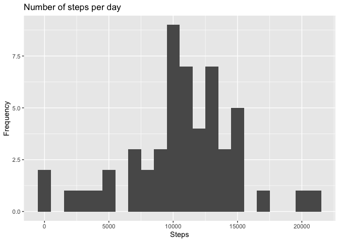
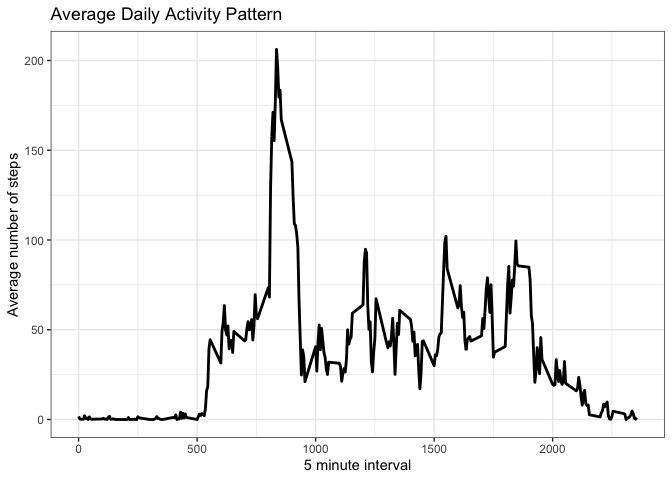
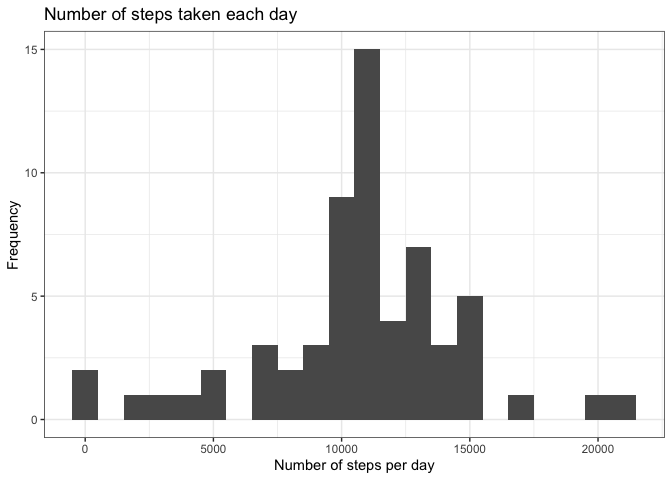
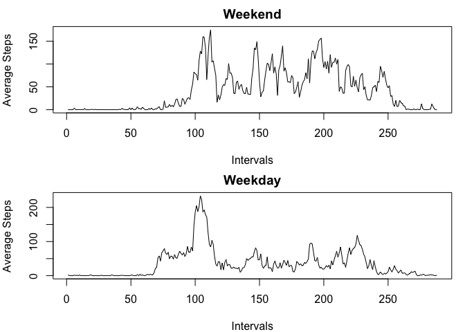

## Loading and preprocessing the data


```r
## Load the data
activity <- read.csv ("activity.csv", header=TRUE, sep = ",", dec=".")
activity$date <- as.Date(activity$date)
activity$interval <- as.factor(activity$interval)
str(activity)
```

```
## 'data.frame':	17568 obs. of  3 variables:
##  $ steps   : int  NA NA NA NA NA NA NA NA NA NA ...
##  $ date    : Date, format: "2012-10-01" "2012-10-01" ...
##  $ interval: Factor w/ 288 levels "0","5","10","15",..: 1 2 3 4 5 6 7 8 9 10 ...
```

## What is mean total number of steps taken per day?


```r
## Calculate the total number of steps taken per day
stepsDay <- aggregate(steps ~ date, activity, sum, na.rm = TRUE)
colnames(stepsDay) <- c("date","steps")
head(stepsDay)
```

```
##         date steps
## 1 2012-10-02   126
## 2 2012-10-03 11352
## 3 2012-10-04 12116
## 4 2012-10-05 13294
## 5 2012-10-06 15420
## 6 2012-10-07 11015
```

```r
## Make a histogram of the total number of steps taken each day
library(ggplot2)
ggplot(stepsDay, aes(x = steps)) +
    geom_histogram(binwidth = 1000) +
    labs(title = "Number of steps per day", x = "Steps", y = "Frequency")
```

<!-- -->

```r
## Calculate and report the mean and median of the total number of steps taken per day
## Mean
meanSteps <- mean(stepsDay$steps, na.rm=TRUE)
meanSteps
```

```
## [1] 10766.19
```

```r
## Median
medianSteps <- median(stepsDay$steps, na.rm=TRUE)
medianSteps
```

```
## [1] 10765
```

## What is the average daily activity pattern?


```r
# Aggregate steps by intervals of 5 minutes 
stepsInterval <- aggregate(activity$steps, 
                                by = list(interval = activity$interval),
                                FUN=mean, na.rm=TRUE)
stepsInterval$interval <- 
        as.integer(levels(stepsInterval$interval)[stepsInterval$interval])
colnames(stepsInterval) <- c("interval", "steps")

# Plot
library(ggplot2)
ggplot(stepsInterval, aes(x=interval, y=steps)) +   
        geom_line(size=1) +  
        labs(title="Average Daily Activity Pattern", x="5 minute interval", y="Average number of steps") +  theme_bw()
```

<!-- -->

```r
# Which 5-minute interval, on average across all the days in the dataset, contains the maximum number of steps?
max_interval <- stepsInterval[which.max(stepsInterval$steps),]
max_interval
```

```
##     interval    steps
## 104      835 206.1698
```

## Imputing missing values


```r
## Calculate and report the total number of missing values in the dataset
numberMissingValues <- sum(is.na(activity$steps))
numberMissingValues
```

```
## [1] 2304
```

```r
## Filling in all of the missing values in the dataset using the mean
## Create a new dataset that is equal to the original dataset but with the missing data filled in.
activityFull <- activity
index<-which(is.na(activityFull$steps))
l<-length(index)
averageSteps<-with(activityFull,tapply(steps,date,mean,na.rm=TRUE))
na<-mean(averageSteps,na.rm = TRUE)
for (i in 1:l) {
        activityFull[index[i],1]<-na
}
numberMissingValues <- sum(is.na(activityFull$steps))
numberMissingValues
```

```
## [1] 0
```

```r
## Make a histogram of the total number of steps taken each day and calculate and report the mean and median total number of steps taken per day
stepsDayFull <- aggregate(steps ~ date, activityFull, sum)
colnames(stepsDayFull) <- c("date","steps")

##plotting the histogram after imputing missing values
ggplot(stepsDayFull, aes(x = steps)) + 
       geom_histogram(binwidth = 1000) + 
        labs(title="Number of steps taken each day", 
             x = "Number of steps per day", y = "Frequency") + theme_bw() 
```

<!-- -->


## Are there differences in activity patterns between weekdays and weekends?


```r
library(dplyr)
```

```
## 
## Attaching package: 'dplyr'
```

```
## The following objects are masked from 'package:stats':
## 
##     filter, lag
```

```
## The following objects are masked from 'package:base':
## 
##     intersect, setdiff, setequal, union
```

```r
## Create a new factor variable in the dataset with two levels – “weekday” and “weekend” indicating whether a given date is a weekday or weekend day.

activityNew<- mutate(activity, day = ifelse(weekdays(activity$date) == "Saturday" | weekdays(activity$date) == "Sunday", "weekend", "weekday"))
activityNew$day<-as.factor(activityNew$day)
str(activityNew)
```

```
## 'data.frame':	17568 obs. of  4 variables:
##  $ steps   : int  NA NA NA NA NA NA NA NA NA NA ...
##  $ date    : Date, format: "2012-10-01" "2012-10-01" ...
##  $ interval: Factor w/ 288 levels "0","5","10","15",..: 1 2 3 4 5 6 7 8 9 10 ...
##  $ day     : Factor w/ 2 levels "weekday","weekend": 1 1 1 1 1 1 1 1 1 1 ...
```

```r
# Plot
activityWeekend <- subset(activityNew,as.character(activityNew$day)=="weekend")
activityWeekday <- subset(activityNew,as.character(activityNew$day)=="weekday")
stepsWeekend <- with(activityWeekend,tapply(steps,interval,mean,na.rm=TRUE))
stepsWeekday <- with(activityWeekday,tapply(steps,interval,mean,na.rm=TRUE))
intervalWeekend <- unique(activityWeekend$interval)
intervalWeekday <- unique(activityWeekday$interval)
newWeekend <- data.frame(cbind(stepsWeekend,intervalWeekend))
newWeekday <- data.frame(cbind(stepsWeekday,intervalWeekday))
par(mfrow=c(2,1),mar=c(4,4,2,1))
plot(newWeekend$intervalWeekend,newWeekend$stepsWeekend,type = "l",xlab = "Intervals",
     ylab = "Average Steps",main = "Weekend")
plot(newWeekday$intervalWeekday,newWeekday$stepsWeekday,type = "l",xlab = "Intervals",
     ylab = "Average Steps",main = "Weekday")
```

<!-- -->
